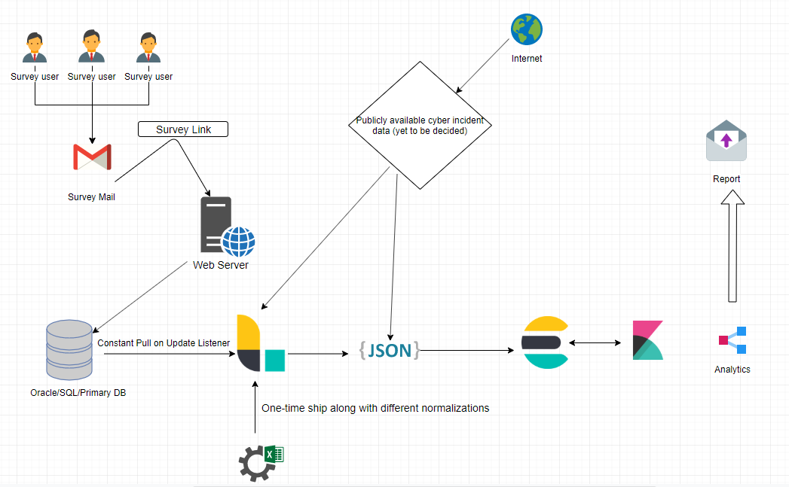
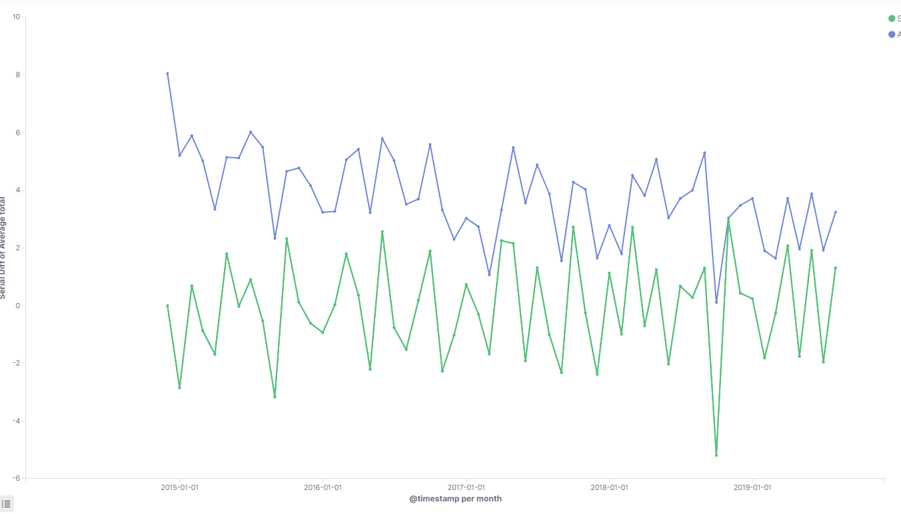

# Cyber Metrics: Abstract
Quantifying cyber risk is one of the biggest challenges in info sec today. Since the advent of the Orange book, people have been trying to quantify security or measure it in some form. Does the phrase "less" or "more secure" have any inference ? Though security may never be directly measured, can there be some metrics for it. There are various frameworks, and organizations such as PCI-DSS, NIST standards, BSIMM which focuses on software security. 

This endeavour of cyber metrics done by the research team at NYU asks the question whether a reliable metrics of cyber metrics can be formed by asking the gut feeling of cybersecurity experts.

NYU's cyber metrics index of expert opinion or "gut feeling" on status of cyber security has been collecting opinion data over the last 8 years. This is an attempt to parse through and analyze the data with the ELK stack and conclude whether any corelations can be drawn between "gut feeling of experts" and "the actual state of cyber security". 

## Overview
A part of a team of 6 students in the Fall semester, working to find relation between various aspects of the data collected by survey started 8 years back by Dan Geer and Mukul Pareek. This repository stores the work done by me as part of contributing to the index and improving the data collection process and co-relation 

## Data Collection

The collection of the data has been done over the past few years by sending out survey questions to handpicked cyber security veterans and experts in fields on a monthly basis, and storing the data in a csv format. Over-time this posed challenges, as the insights that can be drawn from flat files is limited, as well as the searchability of data is also restricted. It was then collectively decided to move to better way of collecting, aggregating and visualizing this data. The collective plan is to now ship the data in a streamlined basis into a manageable format. This repository documents work done in this area using the ELK stack (Elasticsearch, Logstash , Kibana) and also outlines the plan for the future setup of the data pipeline.

The data collection involves collecting data from 2 major sources. 

The one is where the expert opinion was taken from experts and the one which has been fed into the Index for the past years using survey. 

The other is the source of public breach or vulnerability data which can be used to draw some sort of co-relation or implication , positive or negative and conclude whether the expert opinion in cybersecurity has a form of tangible and substantial implication in affirmation or in negation. 

This is the aspect where I have been involved in this project in working , and finding patterns in the existing data as well as between existing and breach data which can lead to something conclusive.

## Collection infrastructure

When dealing with data feeds which is expected to grow in size, it is important to systemize the collection and parsing of this data, so it can be scaled , pushed off to cloud if need for either arises. 

Based off of the above statement, I came up with a single-pipeline based architecture for maintaining the cyber index in the years to come .

The technologies I used for this implementation are as follows:

- **Painless :** Scripting Language to modify data on the fly during visual analysis on data. Helps in reduce time of reparsing and processing data in case there are minor changes required.
- **Logstash**: Primarily used as a centralized "stasher". It has the remarkable simplistic execution of stitching together multiple inputs and outptuts together and reads from a configuration files. Logstash in this project was used to pull in , and segregate data from different sources including SQL, Online API , CSV and JSON.
- **Elasticsearch** : Distributed and resilient noSQL data storage that enables fast querying and full-text search on data using a simple REST API and most importantly compatible with the visualization stack Kibana which can be used to discover incisive visual insights onto data.
- **Kibana**: Kibana is a visual analysis tool that can be used to dig deep into the existing static and live data with a plethora of analysis tools which are easy to use and can perform sophisticated co-relations with multiple feeds of data.

For co-relation we would be trying to normalize and de-normalize data and compare them with the charts we see in the publicly available cyber data.  The architectural overview is shown by the diagram below. 

### Challenges of Finding Co-relation Data
To be able to corelate public opinion with breach is a challenging task. The challenge of finding such a data source is three-fold. 

Firstly, Finding data sources or metrics that track every breach is a daunting tasks. Many organizations do not want to make this sort of data public and there are some organizations which keep track or maintain this kind of data actively.  There are some resources which summarize the data over and there is then a considerable loss of granularity which is required for co-relation.

Secondly, these are the some of the sources that I found feasible for co-relation attempts with surveyed data along with their sources. Even found, there should be some form of justified co-relation with the publicly available data.

There are some data sources which have the right amount of data , but are difficult to scrap, parse or convert due to their format and hence cannot be effectively used for co-relation.

Some of the feeds I monitored for this are as under. These may be useful in future analysis and work on the index. 

https://www.hackmageddon.com/category/security/cyber-attacks-statistics/

https://www2.deloitte.com/content/dam/Deloitte/kz/Documents/risk/KZ_Deloitte_Information_Security_Survey_2014_EN.pdf

https://www.informationisbeautiful.net/visualizations/worlds-biggest-data-breaches-hacks/

The last link is the one which I chose for the further data analysis. The data shows the major data breach event that crossed 30,000 records and categorizes them on the basis of It is chosen primarily because of 3 reasons.

1. The data has relevant granularity covers a valid timespan about breaches with respect to the survey data
2. The data is easy to scrap and parse and compare.
3. The expert and human opinion often tends to be influenced by the media and the major breaches, and I felt this source of data would be a good point to draw co-relations with the survey data.

## Patterns in existing Data

Before, the correlation was done, I spent considerable amount of time trying to find insights in the existing survey data. These include looking for relation between different attributes or demographic or threat actors of the data. Some interesting patterns and co-relations have been highlighted below. The main aim is to find a reason or implication for the ~5000 time increase of the indexes judgement of *Things getting worse*. 

There could be actors in the data which are causing a weighted shift or bias in the results and if so, attempt was made to isolate these biases.

### Pattern-1: Mathematical Average and Serial Differences

This was done to identify patterns which were not revealed by the normal unmodified data. There was no tangible pattern found or detected by this visualization.

## Normalizing or Modifying Input Weights

## Co-relation analysis 

## Improvements in Surveying Methodologies

## Conclusions 